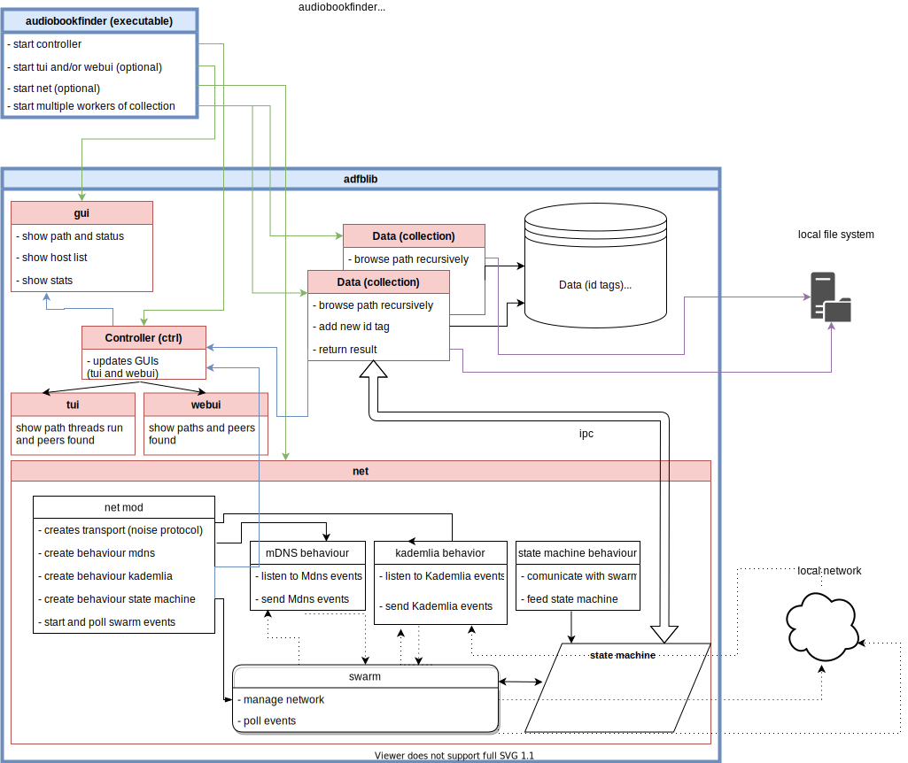

# audiobookfinder (adbf)
An example program to learn [Rust](https://www.rust-lang.org/) and meet its concepts by: find audio books on different machines.

### Why Rust?
Rust is an awesome but difficult to learn programming language using different approaches and concepts to solve the current main software development issues for system programming, such as parallelism (what else to do with this multi-core, we are not getting much faster any more), safety and security (let the computer/compiler do what it can do better than a programmer, more quality but also IOT ... I want safe products at home which cannot be turned into zombie devices by buffer overflow), and more high-level approaches which lets you implement more functionality in less code.

As a C++ developer, I know some of the C++11/14/17 enhancements and some don't convince me at all, just look here about the "costs" you have and what it looks like in Simon Brand's ["How Rust gets polymorphism right"](https://www.youtube.com/watch?v=VSlBhAOLtFA).

# Table of Content
0. [My first program in Rust](#my-first-program-in-rust)
1. [Documentation](#documentation)
2. [Goals](#goals)
3. [Changes](#changes)
4. [ToDo](#todo)
5. [Dependencies](#dependencies)
6. [Architecture](#architecture)
7. [Issues](#issues)
8. [Yet in plan](#yet-in-plan)

## My first program in Rust
Actually I plan to do something useful. The program collects all information about (yet) audio books on different devices/clients, stores it and then does something with it, like showing stats, finding duplicates, aggregating everything at one place. The task of collecting audio book data (id tag) can be exchanged with any other task, this basically leads to a local network agent approach with zero-config. [Architecture](#architecture) to understand a bit beforehand is found here.

So far only the state charts and their connection is not done but the general communication/lookup works, collecting some data as well.

### Documentation
It is an inline [CI](https://travis-ci.org/electricherd/audiobookfinder/) generated documentation which can be found [here](https://electricherd.github.io/audiobookfinder/audiobookfinder/index.html)! Rust does a nice job here as well!

### Goals
The primary goal is to learn Rust and to cover various aspects of the language, of which some of I already used inside the program, such as:
* borrowing: the borrow checker, I am getting more comfortable with it, but very good
* shared-data over different threads (not yet lifetime optimized)
* multi-threading, a lot of threads and communication is inside, also  ([Rayon](https://github.com/rayon-rs/rayon))
* an optional graphical interface that even runs on console only machines (the [Cursive](https://github.com/gyscos/Cursive) TUI)
* [architecture](#architecture) (modules), did some rework with file structure but it is not yet perfect in Rust, really. Now the code is better hidden inside a library... this gives some more opportunities
* high-level functionality of different crates / including/using different crates (I don't want to reinvent the wheel)
* Generics: a little bit about and how to use Generics, really nice, a bit difficult to search and fully adapt for but clear in its usage and powerful!!
* in-code documentation with html generation, really nice!
* easy command-line (always was looking for that, nice: [clap](https://github.com/kbknapp/clap-rs))
* channel/thread communication (creating worker threads easily, there are plenty implemented yet, no concurrency problems!!)
* high level networking (mDNS): theoretically working, but 1st package depends on avahi ([register](https://github.com/plietar/rust-mdns)), [2nd](https://github.com/dylanmckay/mdns) even [fork](https://github.com/NervosFoundation/rust-mdns-discover) causes heavy CPU-load ...
* use the test feature of Rust (one mod only yet), also with example test being tested!
* traits (first a simple drop with print message), but then more, need to be more comfortable with debug for formatting
* thread-pool: a simple self written but nice to use implemention :blush:
* simple timers, alive signal in TUI (yet a sleep thread for each timer, not perfect but since thread-pool quite ok)
* before multiple c-library dependency: easy cross compile (and test) for raspberry (v1 and v2, v3)... ok the tui update needs adjustment
* logging (own module for that), good
* client/server authorization/management in a safe way (some small crypto with [thrussh](https://pijul.org/thrussh/)), looking at [Pierre-Étienne Meunier - Building SSH servers in minutes](https://www.youtube.com/watch?v=TKQoPQcKKTw).
* CI with [travis](https://travis-ci.org/electricherd/audiobookfinder/) works, cross compiling is still difficult with [trust](https://github.com/japaric/trust), [cross](https://github.com/japaric/cross/), [docker](https://www.docker.com/), need to watch closely to [steed](https://github.com/japaric/steed) for some problem solving.
* travis automatically built and automatically deployed own public [documentation](https://electricherd.github.io/audiobookfinder/audiobookfinder/index.html)
* making a library ([adbflib](https://electricherd.github.io/audiobookfinder/adbflib/index.html) as the main part of the program)
* using a [state machine](https://github.com/fitzgen/state_machine_future) wher
e it fits, here for client server *communication* states
* learning [futures](https://en.wikipedia.org/wiki/Futures_and_promises)

### Changes
* decomposed a part of thrussh communication to embed a state chart somehow (still question how to combine the state chart with the other future)
* added architecture graphics using [draw.io](https://draw.io), which is awesome. Also connectable by [github support](https://about.draw.io/github-support/) directly via [this](https://www.draw.io/?mode=github) ([howTo](https://github.com/jgraph/drawio-github)).
* lazy static used to not load server key every time a client connects
* state machine not yet used (need to think more about "futures" architecture and understand futures and how to combine)
* the client ssh connector (com_client) is behind a state machine (to have reconnect and similar easily)
* thrussh mechanism did always work, no problem, just wrong traces, and irritating ipv6, localhost addresses. Added auth message, with identification, will add simple zero-knowledge mechanism.
* updated crates, also formatter changes (alphabetical order)
* adapted all to more lucid imports (in stable Rust now)
* finally try ssh connection to addresses found (own ip/server found, but still a [thrussh](https://www.google.de/url?q=https://pijul.org/thrussh/&sa=U&ved=0ahUKEwiBmqnl2I7aAhVD0xQKHb2DCV4QFggUMAA&usg=AOvVaw0hRK-lIPzabrl2u5VQj4fj)  connecting issues, not clear why)
* corrected mdns thread to add found ip addresses, not before
* more documentation on usage, also including information from `Cargo.toml` data directly
* replaced [id3](https://github.com/jameshurst/rust-id3) with [taglib](https://github.com/ebassi/taglib-rust/) (more external libs, but many more available media tags). Unfortunately it took me quite some time to find some strange difference (didn't work) between [crates.io](https://crates.io/crates/taglib) and original [github.com](https://github.com/ebassi/taglib-rust/) version, so I had to use the git pull rather than the convenient crate.io dependency usage in `Cargo.toml`.
* I suspended the usage of [trust](https://github.com/japaric/trust) which uses [cross](https://github.com/japaric/cross), since the develop cross compiling docker images are based on ubuntu 12.04 (deb jessie), and the libsodium, libavahi uses ubuntu ppa from newer versions. I might even go to xenial (deb stretch), then both libs are included by default. But I would have to create my own dockerfile for that, and not just extend the well prepared dockerfiles from cross. :unamused:
* first travis release build, only x64 unfortunately is correct (with libsodium13 because of trusty and ppa, good luck :expressionless:) [releases](https://github.com/electricherd/audiobookfinder/releases). It's more difficult than I thought, but it's clear now, std is still a problem, suspending work on that for a time.
* [documentation](https://electricherd.github.io/audiobookfinder/audiobookfinder/index.html) deployed, awesome: Rust + github + travis +... (needs javascript enabled)
* applied single test file for travis run: took Bachs Toccata And Fugue In D Minor by Paul Pitman (licence PD)  [orangefreesounds](www.orangefreesounds.com/toccata-and-fugue-in-d-minor/) in rememberring [Monthy Python's grand rugby match](https://www.youtube.com/watch?v=HKv6o7YqHnE).
* travis CI working
* more documentation locally as html: `cargo doc --no-deps --open`
* fixed ui with BoxView and correct id finding (looks like bug is in Cursive)
* refactored lookup method in net (needs more comments now)
* file logging in (use [glogg](http://glogg.bonnefon.org/))
* updated all external crates
* logging mechanism introduced (`logit.rs`). It was needed because of tui console output was not readable (either syslog or console)
 * run e.g. with `RUST_LOG=adbflib::net=debug RUST_BACKTRACE=full cargo run -- -n ~/Audiobooks`
* ssh client with example key works, key now external
* found emojis :grin:
* included Rust doctest, since it is mostly a library, works well
* using a config mod
* new mDNS crate for searching (which is very cpu consuming, but the new one is just a very recent fork, but hoping)
* common.rs for common helper, such as a thread-pool

### ToDo
* further client thrussh improvements, add secure identification by using zero-knowledge
* change interface of ctrl messages to possibly decouple ctrl dependency ... (redo tui messages, ctrl messages (maybe into extra mod)
* not think of travis CI
* understand trussh communication, creating key, authorize
* test more different targets using [this](https://github.com/japaric/trust)
for client and server, the example looks promising
* nicer timer (thread pool is good but still with sleep)
* make cross compiling as easy as possible
* get rid of Avahi

## Dependencies
Unfortunately the program now uses mDNS-register with [dns-sd](https://github.com/plietar/rust-dns-sd) depends on Linux on [Avahi](https://www.avahi.org/)
* `libavahi-client-dev` or `libavahi-compat-libdnssd-dev`. It also breaks first the easy cross compilation :confused: - I will see where this ends.
But it works I can see myself with a mDNS scanner, so I can also find other audiobookfinder clients when I do it correctly
* `libsodium`: Since I started to adapt to thrussh I also need libsodium
* `libtag1-dev` and `libtagc0-dev` for libtag

## Architecture

(still early version of drawing, and directly [editable](https://www.draw.io/?mode=github))

### Issues
* logging from other modules too detailed/too much
* how to decide if an mDNS device is duplicated (more than 1 ipAdress representation, which is correct?, and do they come not within the same record)
* no net is a problem
* bad mDNS search interface to external crate needs a further timeout, even kill a newly created search thread.
* tui update on Raspberry was slow, better find another way

### Yet in plan
* create a key yourself!! And store, which is going to be done if not found at startup
* communication is now easy with ssh but how to authenticate as a valid adbf? Look at ssh details, and zero-knowledge or something similar: hiding key or secrecy knowledge in code without being to obvious (first should be a simple string, don't bother too much)
* rework the one stub for worker thread to have many worker threads in net to do something with found addresses (use thrussh simple example)
* snap linux packaging / online compiler like [Travis](https://docs.travis-ci.com/user/getting-started/) for various target compilation service
* further lifetimes optimizations
* exchange of data over net (probably de-/serialization using [serde](https://docs.serde.rs/serde/))
* [ATOM](https://atom.io/) is my choice for development, on my Eee Pc [sublime](https://www.sublimetext.com), because of small footprint and performance
  * [sublime text](https://www.sublimetext.com) is good and fast, setup was ok, racer etc.
  * [ATOM](https://atom.io/), looks good, no refactoring though, many plug-ins for rust, has README.md syntax
  * [IntelliJ IDEA](https://intellij-rust.github.io/install.html) [download with snaps](https://blog.jetbrains.com/idea/2017/11/install-intellij-idea-with-snaps/), and then Rust plug-in: easy, refactoring, spell-check, nice (but editor ... column select??, close tab??), but looks professional
* internationalization (which is not really supported yet by Rust)
* a good and fast data collection
* maybe a little AI layer on determining audio books duplicates/same author by similar spelling, etc.
